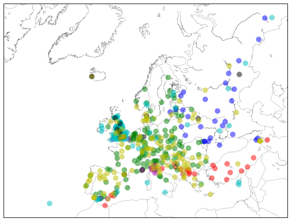
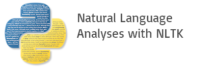

## Grouping European Cities by Tourist Activities using K-means Clustering

This project groups European cities by using K-Means Clustering on descriptions of tourist attractions. Data were scraped from Trip Advisor and Wikitravel, collected in a Mongo database, and stored in json files.

After reading in the data, the text was cleaned to only include English words. Term frequency over the entire corpus was plotted to identify when a word is overly common or overly rare (appearing only once). Words that are too common or too rare are removed, along with words that appear to have no relevant meaning.

Using sklearn's feature_extraction and KMeans tools, the cities are assigned to clusters.

The top words and a sample of the cities are printed for each cluster, and the clusters assignments are plotted on a map of Europe.
